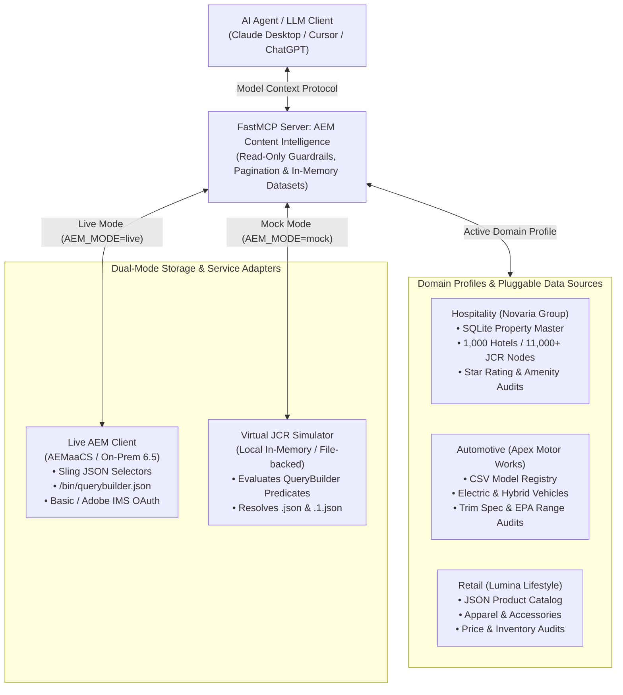

# AEM MCP Starter Kit 🚀

> **The Open-Source Model Context Protocol (MCP) Server for Adobe Experience Manager (AEM Sites, Content Fragments & DAM Assets).**  
> *Demonstrating Agentic RAG over Native Structured Systems vs. Brittle Vector Databases.*

[](LICENSE)
[](https://www.python.org/downloads/)
[](https://github.com/fabidi/aem-mcp-starter-kit/actions/workflows/ci.yml)
[](https://gofastmcp.com/)

---

## Why AEM MCP?

Most enterprise generative AI tutorials force-fit unstructured vector databases (Pinecone, Chroma, embeddings) onto structured CMS content. In Adobe Experience Manager (AEM), where content is already structured hierarchically (JCR), typed (`cq:Page`, Content Fragment Models), and indexed via QueryBuilder, **vector search is often an anti-pattern**:
- Vectors cannot evaluate template rules or resource types (`sling:resourceType`).
- Vectors cannot detect missing language copies or broken asset paths.
- Vectors cannot reconcile authored marketing claims against canonical enterprise systems of record.

By exposing AEM's native JCR content representations and QueryBuilder predicates through a thin, read-only **Model Context Protocol (MCP)** server, frontier models (Claude 3.7 Sonnet, GPT-5, Cursor, ChatGPT Work) can autonomously investigate, audit, and govern enterprise repositories with zero hallucination.



---

> [!NOTE]
> **Fictional Demo Domains Notice:**
> - **Hospitality:** **"Novaria Hospitality Group"** (`novariahotels.com`, `NVR-*`, `/content/novaria`)
> - **Automotive:** **"Apex Motor Works"** (`apexmotors.example.com`, `APX-*`, `/content/apex`)
> - **Retail:** **"Lumina Lifestyle Retail"** (`luminafashion.example.com`, `LUM-*`, `/content/lumina`)
>
> All associated brands, products, vehicle specs, and personnel are 100% fictional demo entities created strictly for testing, agentic RAG evaluation, and open-source demonstration. Any resemblance to actual companies or registered trademarks is purely coincidental.

## Key Features

1. **Pluggable Multi-Domain Architecture:**
   - Bundles ready-to-use reference domains demonstrating varied data formats: **Hospitality** (SQLite), **Automotive** (CSV), and **Retail** (JSON).
   - Easily add your own enterprise domain with a simple `domain.yaml` definition.
2. **Zero-Cost Offline JCR Simulator:**
   - Clone and run immediately on your laptop without needing an expensive Adobe Cloud license.
   - Evaluates QueryBuilder predicates, resolves Sling JSON selectors, and simulates live AEM behavior offline.
3. **Dual-System Reconciliation (AEM CMS + Master Entity Registry):**
   - Combines authored marketing content (AEM JCR) with canonical business truths (SQLite, CSV, or JSON) to pinpoint discrepancies (e.g. stale specs, pricing desyncs, missing assets).
4. **Declarative Governance Audit Engine:**
   - Define business validation rules in YAML (field comparisons, existence checks, DAM asset verification) that the MCP server evaluates deterministically across site trees.
5. **In-Memory SQLite Dataset Materialization:**
   - Instead of blowing up the LLM's context window with thousands of raw JSON nodes, the server streams query hits into local SQLite tables, performs server-side analytics, and generates downloadable **Excel (.xlsx)** and **CSV** audit workbooks.
6. **Cloud & On-Premises Ready:**
   - Seamlessly switch between Local Simulator (`AEM_MODE=mock`), On-Prem 6.5 (`AEM_MODE=onprem`), and AEM as a Cloud Service (`AEM_MODE=cloud` with Adobe IMS OAuth 2.0).

---

## 🔌 Adapting to Your Domain & External Data Sources

This MCP server is **not hardcoded to hospitality**. It uses a declarative domain profile architecture that allows you to connect **any enterprise system of record** (ERP, PIM, CRM, or Product Catalog) to audit against AEM content in 3 simple steps:

1. **Create your domain folder:** `mkdir domains/my-domain`
2. **Add your data source:** Drop your `.sqlite`, `.csv`, or `.json` file into the folder (or configure external Postgres/Snowflake connection strings).
3. **Declare `domain.yaml`:** Map your external columns to AEM JCR properties and define compliance audit rules.

```yaml
# Example: domains/automotive/domain.yaml
domain:
  name: "Apex Motor Works"
  root_path: "/content/apex"
entity:
  primary_entity: "Vehicle"
  type: "csv"
  file: "registry.csv"
mapping:
  fields:
    vin_prefix: "vinPrefix"      # ERP column <-> AEM JCR property
    base_msrp: "msrp"
audit_rules:
  - id: "msrp_desync"
    condition: "aem.msrp != registry.base_msrp"
    message: "Authored price does not match ERP manufacturing master"
```

👉 **Read the complete guide:** [**Extending Data Sources & Custom Domain Guide**](docs/EXTENDING_DATA_SOURCES.md) for detailed blueprints covering E-Commerce, Automotive, Finance/Insurance, and Healthcare.

---

## 60-Second Quickstart

### 1. Installation
Clone the repository and install with `uv` (recommended) or `pip`:

```bash
git clone https://github.com/fabidi/aem-mcp-starter-kit.git
cd aem-mcp-starter-kit

# Using uv (fastest)
uv venv
uv pip install -e ".[dev]"

# Or standard pip
python -m venv .venv
source .venv/bin/activate  # On Windows: .venv\Scripts\activate
pip install -e ".[dev]"
```

### 2. Generate Synthetic Seed Data (Mock Mode)
```bash
python tools/generate_dataset.py
```
This generates:
- `data/property_master.sqlite` (1,000 canonical hotels, 4 brand tiers, 50 global destinations)
- `data/jcr_mock_store.json` (11,000+ JCR nodes with 350 deliberate audit anomalies across 9 categories)

### 3. Run Autonomous Agent Audit Simulation
Simulate how an autonomous AI Assistant (e.g. Claude 3.7 or ChatGPT) executes an end-to-end 6-phase content intelligence audit across 11,000+ nodes, reconciles PMS records, and generates an Excel report in under 2 seconds:

```bash
python tools/simulate_agent_audit.py
```

### 4. Run the Test Suite
```bash
pytest -v
```

---

## Connecting to AI Clients

### Antigravity IDE Configuration
Add to your Antigravity MCP configuration (`~/.gemini/antigravity/mcp_config.json`):

```json
{
  "mcpServers": {
    "aem": {
      "command": "uv",
      "args": [
        "--directory",
        "/absolute/path/to/aem-mcp-starter-kit",
        "run",
        "aem-mcp"
      ],
      "env": {
        "AEM_MODE": "mock",
        "AEM_DOMAIN": "hospitality"
      }
    }
  }
}
```

### Claude Desktop Configuration
Add the server to your `claude_desktop_config.json`:

```json
{
  "mcpServers": {
    "aem-content-intelligence": {
      "command": "uv",
      "args": [
        "--directory",
        "/absolute/path/to/aem-mcp-starter-kit",
        "run",
        "aem-mcp"
      ],
      "env": {
        "AEM_MODE": "mock",
        "AEM_DOMAIN": "hospitality"
      }
    }
  }
}
```

### Cursor / Windsurf Configuration
Add to your project's `.cursor/mcp.json`:
```json

{
  "mcpServers": {
    "aem": {
      "command": "python",
      "args": ["-m", "aem_mcp.server"],
      "cwd": "/absolute/path/to/aem-mcp-starter-kit",
      "env": {
        "AEM_MODE": "mock",
        "AEM_DOMAIN": "hospitality"
      }
    }
  }
}
```

---

### Domain Management & Discovery Tools
| Tool | Description |
| :--- | :--- |
| `domain_list()` | List all available domain profiles, their formats (SQLite, CSV, JSON), paths, and descriptions. |
| `domain_switch(domain_id)` | Dynamically switch active business domain profile and reload underlying virtual JCR store & registries. |
| `domain_get_active()` | Retrieve metadata and active audit rules of currently selected domain profile. |
| `aem_audit_domain_rules(domain_id, root_path)` | Execute domain-specific declarative audit rules (field validations, DAM checks, price/spec parity). |

### Master Entity Registry Tools
| Tool | Description |
| :--- | :--- |
| `registry_indexes()` | List available business entity tables (`properties`, `brands`, `destinations`, etc.). |
| `registry_search(index, query, city, brand, limit)` | Search canonical records with structured filters. |
| `registry_get(index, identifier)` | Lookup canonical record by primary ID (`hotel_id`, `model_id`, `product_id`). |
| `registry_query_dataset(index, query, max_records)` | Stream and materialize canonical records into an on-disk SQLite dataset table for cross-system reconciliation. |

### AEM Read-Only Tools
| Tool | Description |
| :--- | :--- |
| `aem_json(path, depth)` | Read raw JCR node hierarchy using standard Sling `.json` selectors (depth 0..3). |
| `aem_traverse(path, depth)` | Explore child nodes and descendant levels. |
| `aem_querybuilder(query)` | Execute bounded AEM QueryBuilder predicate searches with execution timing profiling. |
| `aem_find_references(path)` | Recursively discover referenced templates, models, Content Fragments, and assets. |
| `aem_discover_properties(path, focus_term, node_type)` | Discover property usage and observed values across child nodes. |
| `aem_query_dataset(query, properties)` | Materialize large QueryBuilder search results into an in-memory SQLite table. |

### Content & Discrepancy Auditing Tools
| Tool | Description |
| :--- | :--- |
| `aem_audit_content_integrity(root_path)` | Scan content trees for broken DAM hero assets, expired promo campaigns, and incomplete Content Fragments. |
| `aem_audit_cross_reference(path)` | Reconcile AEM authored properties against Canonical PMS database (star ratings, booking status, amenity desyncs, orphan pages). |
| `aem_audit_localization_coverage(base_locale, target_locales)` | Measure regional translation parity and pinpoint missing localized pages across target locales (e.g. `fr/fr`, `de/de`, `jp/ja`). |
| `aem_compile_querybuilder_sql2(query)` | Compile QueryBuilder predicates into Oak-optimized JCR-SQL2 for index tuning and developer analysis. |
| `aem_lint_query_indexing(query, simulate_cost)` | Detect unindexed Oak traversals, evaluate 10,000-node scan abort risk, and generate remediation `/oak:index` definitions. |

### Dataset Analysis & Export Tools
| Tool | Description |
| :--- | :--- |
| `dataset_info(dataset_id)` | View row counts and metadata of a materialized query dataset. |
| `dataset_get_rows(dataset_id, offset, limit)` | Read a bounded slice of rows. |
| `dataset_analyze(dataset_id, operation, field)` | Perform server-side `group_by`, `count`, `missing`, or `filter` aggregations. |
| `dataset_match(left_id, right_id, left_field, right_field)` | Cross-system reconciliation between AEM content and Master Entity Registry. |
| `dataset_export(dataset_id, format)` | Generate a downloadable CSV or standalone Excel (`.xlsx`) audit workbook. |
| `dataset_discard(dataset_id)` | Clean up temporary dataset tables. |

---

## Sample Agent Prompts to Try

Once connected to Claude or ChatGPT:

1. **Content Discovery:**
   > *"Find all luxury hotels in Europe under `/content/novaria` and show me their template and Content Fragment references."*

2. **Cross-System Audit:**
   > *"Audit our European property pages against the Master Entity Registry. Are there any discrepancies between the authored star ratings on AEM pages and the canonical Property Master?"*

3. **Campaign Expiration Check:**
   > *"Search across all hotel detail pages for any promotional Experience Fragment references that link to expired 2024 campaigns."*

4. **Spreadsheet Report Generation:**
   > *"Query all properties in the system, extract their hotel ID, authored rating, and city, and export the findings as an Excel (.xlsx) file."*

---

## License
MIT License. Created by Faisal Abidi.
