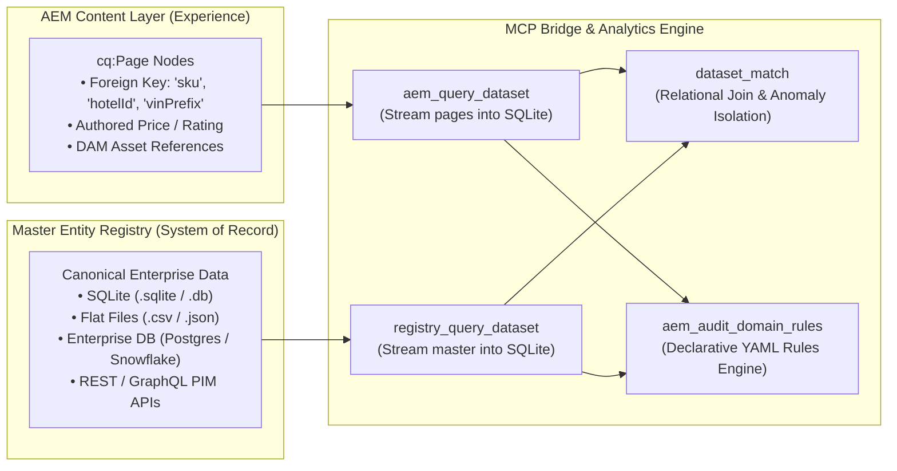

# Extending Data Sources & Custom Domain Guide 🔌

> **How to adapt the AEM Content Intelligence MCP to any enterprise industry, data source, and system of record.**

---

## 1. Architecture: The Decoupled Two-Sided Model

In an enterprise environment, a CMS like Adobe Experience Manager (AEM) is the **Experience Layer**—it is where human authors assemble web pages, place hero images, write marketing descriptions, and structure navigation.

However, AEM is **not the System of Record**:
- Official product prices live in an **ERP (SAP / Oracle / NetSuite)**.
- Official product specifications live in a **PIM (Akeneo / Salsify / InRiver)**.
- Hotel ratings, amenities, and room status live in a **PMS / CRS**.
- Vehicle trims, MSRPs, and EPA ranges live in a **Manufacturing Catalog**.

This MCP server decouples the **AEM JCR Content Layer** from the **Master Entity Registry**, allowing AI agents to bridge both worlds and autonomously detect governance drift, compliance violations, and pricing desyncs.



---

## 2. The Non-AEM Toolset Reference

The MCP provides a dedicated suite of tools specifically for discovering, inspecting, and querying non-AEM master data:

| Tool | Purpose | Typical Agent Usage |
| :--- | :--- | :--- |
| `domain_list()` | Discovers all available domain profiles in the deployment. | *"Which business domains are configured on this server?"* |
| `domain_get_active()` | Returns table schemas, field mappings, and audit rules for the active domain. | Inspects column names, primary keys, and governance constraints. |
| `domain_switch(name)` | Hot-swaps the active domain at runtime with zero downtime. | Switches context from Hospitality (`hospitality`) to Automotive (`automotive`). |
| `registry_indexes()` | Lists canonical tables and record counts in the active data source. | Discovers available entity collections (e.g. `vehicles`, `hotels`, `products`). |
| `registry_search(...)` | Structured search over canonical records with filters. | Looks up specific entities (e.g. `city="Paris"` or `brand="Grand"`). |
| `registry_get(index, id)` | Single-record lookup by primary key (`hotel_id`, `vin_prefix`, `sku`). | Fast fact-checking for an individual authored page. |
| `registry_query_dataset(...)` | **Bulk Ingestion:** Materializes entire canonical tables into a local SQLite dataset. | Streams 50,000 master records into a dataset to prepare for a cross-system join. |
| `dataset_match(...)` | **The Reconciliation Engine:** Performs inner/outer joins between AEM and Master datasets. | Isolates discrepancies: price desyncs, stale ratings, orphan pages. |

---

## 3. Adapting to Your Domain in 3 Simple Steps

Adding your company's domain requires zero changes to the core MCP server code. Follow these three steps:

### Step 1: Create Your Domain Folder
Create a new directory under `domains/` (e.g. `domains/ecommerce/`):
```bash
mkdir -p domains/ecommerce
```

### Step 2: Add Your Data Source File
Drop your canonical data file into the folder:
- **SQLite Database:** `domains/ecommerce/catalog.sqlite`
- **CSV Export:** `domains/ecommerce/products.csv`
- **JSON Catalog:** `domains/ecommerce/inventory.json`

*(For live enterprise databases like PostgreSQL or Snowflake, see Section 4).*

### Step 3: Define `domain.yaml`
Create `domains/ecommerce/domain.yaml` to declare your schema, field mappings, and governance audit rules:

```yaml
domain:
  name: "Lumina Fashion E-Commerce"
  description: "Global omnichannel apparel catalog, warehouse inventory, and seasonal collections"
  root_path: "/content/lumina"
  canonical_site: "shop.lumina.example.com"

entity:
  primary_entity: "Product"
  type: "json"                   # sqlite | csv | json
  file: "inventory.json"
  tables:
    products: "Canonical product master (sku, name, category, price, stock, active)"

mapping:
  aem_node_type: "cq:Page"
  fields:
    sku: "sku"                   # Registry column -> AEM JCR property
    price: "authoredPrice"
    name: "jcr:title"
    active: "pageStatus"

audit_rules:
  - id: "price_desync"
    name: "Authored Price vs ERP Base Price"
    severity: "CRITICAL"
    rule_type: "cross_reference"
    condition: "aem.authoredPrice != registry.price"
    message: "Marketing page price does not match ERP pricing truth"

  - id: "out_of_stock_featured"
    name: "Out-of-Stock Item Active on Site"
    severity: "HIGH"
    rule_type: "cross_reference"
    condition: "registry.stock == 0 and aem.pageStatus == 'ACTIVE'"
    message: "Page is published live but warehouse inventory is 0"
```

Restart or call `domain_switch("ecommerce")`, and the MCP immediately indexes the new domain!

---

## 4. Connecting to Live Enterprise Databases (Postgres, Snowflake, APIs)

If your enterprise truth does not live in flat files or SQLite, the [`DomainManager`](file:///c:/Work/AEM/aem-mcp-starter-kit/src/aem_mcp/domains/manager.py) class is designed with an extensible adapter pattern.

### Pattern: Adding a PostgreSQL / Snowflake Connector

In `src/aem_mcp/domains/manager.py`, the `_load_profile_connection` method can be extended to support enterprise drivers:

```python
# Blueprint for PostgreSQL / Snowflake Adapter
import os

def _connect_enterprise_db(profile: DomainProfile) -> sqlite3.Connection:
    """
    Query an external database (Postgres, Snowflake, BigQuery)
    and mirror the query results into the local ephemeral SQLite memory space.
    """
    if profile.data_source_type == "postgres":
        import psycopg2
        conn_str = os.getenv("ENTERPRISE_DB_URL")
        with psycopg2.connect(conn_str) as pg_conn:
            with pg_conn.cursor() as cur:
                cur.execute("SELECT sku, price, stock, active FROM master_products")
                rows = cur.fetchall()
                # Fast ingest into local SQLite memory table
                sqlite_conn = sqlite3.connect(":memory:")
                sqlite_conn.execute("CREATE TABLE products (sku TEXT PRIMARY KEY, price REAL, stock INT, active BOOL)")
                sqlite_conn.executemany("INSERT INTO products VALUES (?, ?, ?, ?)", rows)
                return sqlite_conn
```

This pattern ensures that **regardless of where your master data originates**, the analytical tools (`dataset_analyze`, `dataset_match`, `dataset_export`) run with sub-millisecond SQLite C-engine speed and zero network latency during audit execution.

---

## 5. Real-World Domain Blueprints

### Blueprint 1: Automotive & Manufacturing (CSV)
- **Data Source:** SAP manufacturing trim export (`registry.csv`).
- **Bridge Property:** `vinPrefix` on vehicle landing pages.
- **Audit Checks:**
  - Vehicle MSRP desync between marketing copy and manufacturing base price.
  - Discontinued trims that marketing authors forgot to unpublish.
  - Missing exterior DAM renders for optional accessory packages.

### Blueprint 2: Financial Services & Insurance (PostgreSQL)
- **Data Source:** Core banking policy database (`policies.sqlite`).
- **Bridge Property:** `policyCode` on insurance product pages.
- **Audit Checks:**
  - Annual Percentage Rate (APR) desync between live pages and treasury rates.
  - Expired promotional APR offers still visible to consumers.
  - Mandatory legal compliance disclaimers missing on high-risk investment pages.

### Blueprint 3: Healthcare & Pharmaceuticals (JSON)
- **Data Source:** Formulary & Drug Master Registry (`drugs.json`).
- **Bridge Property:** `ndcCode` (National Drug Code) on healthcare portal pages.
- **Audit Checks:**
  - Active FDA black-box warning requirements present in page footer.
  - Dosage specification parity between authored Content Fragments and clinical database.
  - Expired clinical trial enrollment forms still accepting patient submissions.

---

## 6. Complete End-to-End Agent Workflow

Here is how an autonomous AI agent executes a complete cross-system audit using the non-AEM toolset:

```
1. DISCOVER DOMAIN:
   Agent: domain_get_active()
   Response: Active domain is 'Apex Motor Works' (Automotive). Primary entity: 'Vehicle'.

2. STREAM AEM CONTENT:
   Agent: aem_query_dataset(
       query={"path": "/content/apex/us/en/models", "type": "cq:Page"},
       properties=["vinPrefix", "msrp", "status"]
   )
   Response: Materialized dataset 'ds_aem_001' (1,250 vehicle pages).

3. STREAM MASTER DATA:
   Agent: registry_query_dataset(
       index="vehicles",
       max_records=5000
   )
   Response: Materialized dataset 'ds_erp_002' (1,250 ERP vehicle records).

4. CROSS-SYSTEM JOIN:
   Agent: dataset_match(
       left_dataset_id="ds_aem_001",
       right_dataset_id="ds_erp_002",
       left_field="vinPrefix",
       right_field="vin_prefix"
   )
   Response: 1,210 matches, 40 discrepancies found (32 pricing mismatches, 8 discontinued trims).

5. ANALYZE & SUMMARIZE:
   Agent: dataset_analyze(dataset_id="ds_match_003", operation="group_by", field="discrepancy_reason")
   Response: Categorical summary of pricing errors.

6. EXPORT WORKBOOK:
   Agent: dataset_export(dataset_id="ds_match_003", format="xlsx")
   Response: Returns download URL for Excel audit workbook.
```
